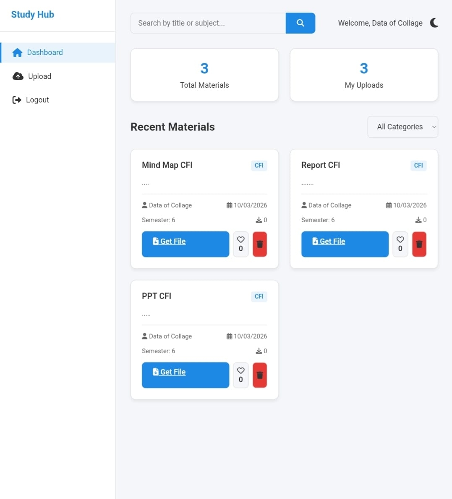

# Harihar Manohar Kadhe - Premium Developer Portfolio ✨

A stunning, ultra-modern, and high-performance digital portfolio built to showcase technical expertise across IoT, frontend interfaces, and robust backend systems. 

Designed with a focus on immersive user experiences, smooth JavaScript micro-interactions, and pure CSS glassmorphism.

 <!-- *Will display once images are uploaded!* -->

## 🚀 Key Features

- **Premium UI/UX:** Dark-mode aesthetic with custom gold accents, sleek 3D hover-tilt interactions, and dynamic custom cursor tracking.
- **Zero Framework Bloat:** Built with pure, lightning-fast HTML5, CSS3, and modern Vanilla JavaScript.
- **Live AJAX Contact Routing:** Fully functional messaging system powered by FormSubmit that securely routs emails directly to the inbox without messy CAPTCHA redirects.
- **Dynamic Insights Engine:** A completely custom blog grid with staggered JavaScript animation logic to reveal hidden articles dynamically.
- **Mobile First:** 100% responsive flexbox/grid layout guaranteeing a pristine viewing experience across all device sizes.

## 🛠️ Featured Projects Included

1. **ElectroSafe Website:** A dedicated Village Electricity Grievance Portal interface. 
2. **Smart Study Hub:** A high-level Dashboard for tracking educational materials and dynamic uploads.
3. **Smart Farming Dashboard:** An IoT monitoring platform actively powered by the **Raspberry Pi Pico W**.

## 💻 Tech Stack

- **Structure:** HTML5 Semantic Markup
- **Styling:** Advanced CSS3 (CSS Variables, Flexbox, CSS Grid, Hover Transfoms, Glassmorphism gradients)
- **Logic:** Vanilla JavaScript (ES6+)
- **Iconography:** Lucide Icons API
- **Deployment:** Vercel (Ready)

## 🌐 Deployment Instructions

This repository is completely structured for zero-configuration modern static hosting.

1. Create a free account on [Vercel](https://vercel.com/).
2. Click **Add New Project**.
3. Import this exact GitHub repository.
4. Leave all settings exactly as default (Framework Preset: `Other`).
5. Click **Deploy**.

## 📬 Contact Me

- **Email:** hariharkadhe2@gmail.com
- **LinkedIn:** [in/harihar-kadhe-930979316](https://in.linkedin.com/in/harihar-kadhe-930979316)

---
*If you are visiting this repository, be sure to click the live Vercel link located in the 'About' section of this GitHub page!*
<!-- dev_sync: Fix minor responsive issues 2026-04-05T13:43:17+05:30 -->
<!-- dev_sync: Fix typo in content 2026-04-06T11:54:48+05:30 -->
<!-- dev_sync: Update documentation 2026-04-07T11:03:12+05:30 -->
<!-- dev_sync: Code cleanup and formatting 2026-04-08T14:47:57+05:30 -->
<!-- dev_sync: Adjust margin and padding for mobile 2026-04-09T15:24:16+05:30 -->
<!-- dev_sync: Refactor component logic 2026-04-10T17:58:35+05:30 -->
<!-- dev_sync: Adjust margin and padding for mobile 2026-04-12T18:55:48+05:30 -->
<!-- dev_sync: Optimize asset loading 2026-04-13T13:27:46+05:30 -->
<!-- dev_sync: Optimize asset loading 2026-04-15T15:25:08+05:30 -->
<!-- dev_sync: Fix minor responsive issues 2026-04-16T15:06:49+05:30 -->
<!-- dev_sync: Adjust margin and padding for mobile 2026-04-18T17:18:02+05:30 -->
<!-- dev_sync: Adjust color variables 2026-04-19T11:52:03+05:30 -->
<!-- dev_sync: Refactor component logic 2026-04-20T12:10:43+05:30 -->
<!-- dev_sync: Fix minor responsive issues 2026-04-21T13:40:07+05:30 -->
<!-- dev_sync: Adjust margin and padding for mobile 2026-04-22T16:52:08+05:30 -->
<!-- dev_sync: Optimize asset loading 2026-04-23T16:11:55+05:30 -->
<!-- dev_sync: Update styling and layout spacing 2026-04-25T15:43:25+05:30 -->
<!-- dev_sync: Adjust color variables 2026-04-26T11:17:51+05:30 -->
<!-- dev_sync: Update documentation 2026-04-27T18:46:25+05:30 -->
<!-- dev_sync: Adjust margin and padding for mobile 2026-04-28T14:01:03+05:30 -->
<!-- dev_sync: Improve accessibility structure 2026-04-29T15:09:21+05:30 -->
<!-- dev_sync: Improve accessibility structure 2026-04-30T13:17:52+05:30 -->
<!-- dev_sync: Adjust margin and padding for mobile 2026-05-01T18:35:57+05:30 -->
<!-- dev_sync: Code cleanup and formatting 2026-05-03T18:48:49+05:30 -->
<!-- dev_sync: Code cleanup and formatting 2026-05-04T12:18:47+05:30 -->
<!-- dev_sync: Adjust margin and padding for mobile 2026-05-05T18:08:23+05:30 -->
<!-- dev_sync: Fix minor responsive issues 2026-05-06T13:19:45+05:30 -->
<!-- dev_sync: Update styling and layout spacing 2026-05-08T16:24:41+05:30 -->
<!-- dev_sync: Update meta tags and SEO adjustments 2026-05-09T16:21:31+05:30 -->
<!-- dev_sync: Adjust margin and padding for mobile 2026-05-11T13:34:41+05:30 -->
<!-- dev_sync: Update styling and layout spacing 2026-05-14T15:48:13+05:30 -->
<!-- dev_sync: Fix minor responsive issues 2026-05-15T18:18:38+05:30 -->
<!-- dev_sync: Adjust color variables 2026-05-16T16:10:16+05:30 -->
<!-- dev_sync: Code cleanup and formatting 2026-05-17T18:06:16+05:30 -->
<!-- dev_sync: Optimize asset loading 2026-05-18T13:50:20+05:30 -->
<!-- dev_sync: Adjust color variables 2026-05-19T14:46:39+05:30 -->
<!-- dev_sync: Adjust margin and padding for mobile 2026-05-21T11:52:10+05:30 -->
<!-- dev_sync: Fix minor responsive issues 2026-05-22T18:10:45+05:30 -->
<!-- dev_sync: Adjust color variables 2026-05-23T14:17:53+05:30 -->
<!-- dev_sync: Fix typo in content 2026-05-24T16:07:36+05:30 -->
<!-- dev_sync: Fix typo in content 2026-05-25T18:29:31+05:30 -->
<!-- dev_sync: Optimize asset loading 2026-05-26T14:03:10+05:30 -->
<!-- dev_sync: Update meta tags and SEO adjustments 2026-05-29T12:29:26+05:30 -->
<!-- dev_sync: Refactor component logic 2026-05-31T12:43:34+05:30 -->
<!-- dev_sync: Adjust margin and padding for mobile 2026-06-01T14:51:26+05:30 -->
<!-- dev_sync: Fix typo in content 2026-06-04T11:02:02+05:30 -->
<!-- dev_sync: Adjust margin and padding for mobile 2026-06-05T14:57:49+05:30 -->
<!-- dev_sync: Update styling and layout spacing 2026-06-06T17:28:24+05:30 -->
<!-- dev_sync: Adjust margin and padding for mobile 2026-06-07T16:04:48+05:30 -->
<!-- dev_sync: Adjust color variables 2026-06-10T12:14:29+05:30 -->
<!-- dev_sync: Code cleanup and formatting 2026-06-11T16:09:42+05:30 -->
<!-- dev_sync: Fix typo in content 2026-06-12T15:15:57+05:30 -->
<!-- dev_sync: Update documentation 2026-06-14T14:11:29+05:30 -->
<!-- dev_sync: Fix minor responsive issues 2026-06-15T14:33:35+05:30 -->
<!-- dev_sync: Update meta tags and SEO adjustments 2026-06-16T13:48:13+05:30 -->
<!-- dev_sync: Adjust margin and padding for mobile 2026-06-17T13:35:58+05:30 -->
<!-- dev_sync: Fix typo in content 2026-06-19T11:01:43+05:30 -->
<!-- dev_sync: Adjust color variables 2026-06-20T15:23:49+05:30 -->
<!-- dev_sync_multi: Code cleanup and formatting 2026-04-07T18:40:54+05:30 -->
<!-- dev_sync_multi: Adjust margin and padding for mobile 2026-04-07T10:47:03+05:30 -->
<!-- dev_sync_multi: Update documentation 2026-04-08T16:04:31+05:30 -->
<!-- dev_sync_multi: Tweak animations and transitions 2026-04-08T17:29:51+05:30 -->
<!-- dev_sync_multi: Update meta tags and SEO adjustments 2026-04-09T10:39:16+05:30 -->
<!-- dev_sync_multi: Optimize asset loading 2026-04-09T15:08:04+05:30 -->
<!-- dev_sync_multi: Fix typo in content 2026-04-10T13:07:37+05:30 -->
<!-- dev_sync_multi: Optimize asset loading 2026-04-10T12:22:13+05:30 -->
<!-- dev_sync_multi: Improve accessibility structure 2026-04-14T15:04:19+05:30 -->
<!-- dev_sync_multi: Adjust color variables 2026-04-15T10:27:49+05:30 -->
<!-- dev_sync_multi: Adjust color variables 2026-04-16T17:53:15+05:30 -->
<!-- dev_sync_multi: Update dependencies 2026-04-16T16:11:35+05:30 -->
<!-- dev_sync_multi: Refactor component logic 2026-04-18T17:49:58+05:30 -->
<!-- dev_sync_multi: Fix typo in content 2026-04-19T14:54:58+05:30 -->
<!-- dev_sync_multi: Refactor utility functions 2026-04-19T12:30:45+05:30 -->
